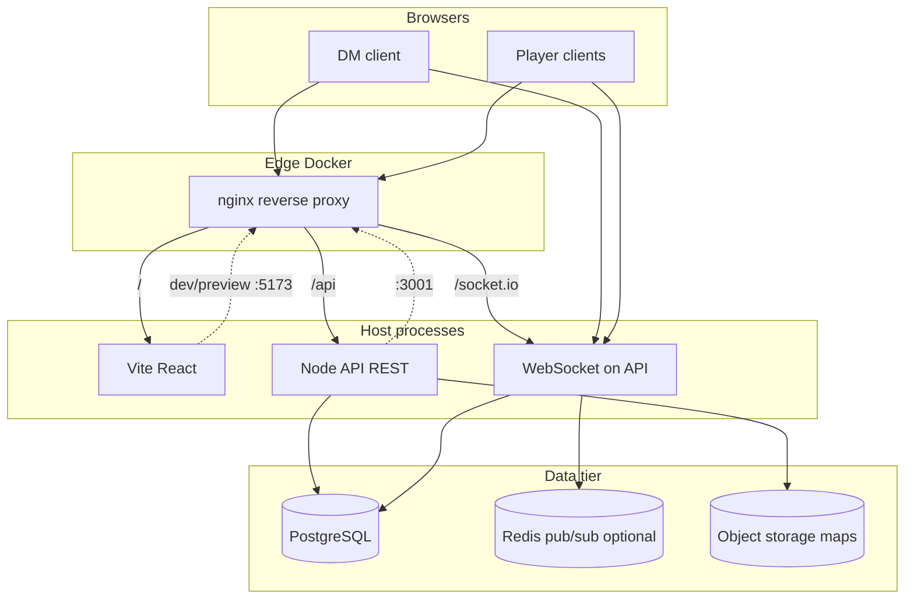

# System architecture

## Goals

1. **Session-centric play** — A DM runs one or more concurrent *games*; each game has players, characters, and an optional tactical map.
2. **Role-based visibility** — DM reads all character sheets in active game; each player reads only characters they own in that game.
3. **Rich character sheets** — Stats, derived modifiers, equipment (weapons, armor, treasure, misc), disposables (torches, rations, liquids).
4. **Tactical map** — DM uploads or draws maps; places and moves PC/NPC tokens; shows movement radius from speed/rules.
5. **Optional Purple Sorcerer workflow** — Import JSON/CSV exports (no official API); native generator as fallback.

## High-level diagram



## Monorepo applications

### `apps/web` (React + MUI)

| Area | Responsibility |
|------|----------------|
| **Auth shell** | Login/register or invite-link join; JWT in httpOnly cookie or memory + refresh |
| **Lobby** | DM: list/create games, switch active game; Player: join via code/link |
| **Character workspace** | Tabbed sheet editor/viewer; inventory grids; modifier breakdown |
| **Map workspace** | Canvas layer (recommend **Konva** or **react-konva**); DM tools only for edit; players see fog/visibility per policy |
| **Import wizard** | Upload Purple Sorcerer JSON/CSV → map to internal schema → review → save |

MUI theming: dark “dungeon” default + light option; use `ThemeProvider` + per-game accent optional later.

### `apps/api` (Node + TypeScript)

Recommend **Fastify** for performance and schema-first routes (aligns with Zod in `packages/shared`).

| Module | Endpoints / events |
|--------|-------------------|
| `auth` | Register, login, refresh, profile |
| `games` | CRUD games, invite codes, membership |
| `characters` | CRUD per game; list filtered by role |
| `inventory` | Nested under character |
| `maps` | Upload image, metadata, layers, tokens |
| `realtime` | Sheet patches, map token moves, presence |

**WebSocket rooms:** `game:{gameId}` — subscribe on join; server validates membership before emit.

### `packages/shared`

- TypeScript interfaces for all DTOs
- Zod validators shared by API and web forms
- DCC constants (ability keys, item categories, default movement rules)

## Core user flows

### DM creates and switches games

1. DM authenticates → `POST /games` → receives `gameId` + invite code.
2. Multiple games appear in sidebar; **active game** stored client-side and sent as `X-Game-Id` header (or path prefix `/games/:id/...`).
3. DM opens game → loads all characters + map state via REST; subscribes to `game:{id}` socket.

### Player joins

1. Player uses invite link `/join/:code` → `POST /games/join` → membership row `game_players`.
2. Player creates or imports characters → `game_id` + `owner_user_id` scoped.
3. Player UI only lists `GET /games/:id/characters?mine=true` (server enforces).

### Live sheet edit

1. Optimistic UI update on field blur or debounced keystroke.
2. Client sends `character:patch` with JSON Patch or field-level delta.
3. Server persists, broadcasts to room; DM receives all, players only if `ownerUserId === socket.userId` OR event is `dm_broadcast`.

Conflict policy: **last-write-wins per field** with `updatedAt` + `version` for optional merge UI later.

### Map session

1. DM uploads PNG/WebP → stored in object storage; URL returned to clients.
2. DM sets **grid**: size (ft), cell px, snap on/off.
3. Tokens: `{ id, type: pc|npc|object, label, x, y, imageUrl?, characterId? }`.
4. Movement radius: client draws circle/hex from `speed` or user-entered feet; server stores optional `reachableArea` only for audit, compute client-side from rules.
5. Player clients: read-only map or token move limited to own PC token if enabled in game settings.

## Security model

| Role | Characters | Map edit | Map view | Game admin |
|------|------------|----------|----------|------------|
| DM (game owner) | All | Yes | Yes | Yes |
| DM (co-DM future) | All | Yes | Yes | Configurable |
| Player | Own only | No* | Yes | No |

\*Optional: allow players to drag **their** token only.

- All routes: `Authorization: Bearer` + membership check on `gameId`.
- WebSocket handshake: same JWT; join room only if `game_players` or `games.dm_user_id`.
- Uploaded maps: virus scan + MIME verify + size cap; signed URLs with TTL.

## Technology choices (recommended)

| Concern | Choice | Rationale |
|---------|--------|-----------|
| ORM | Prisma | Migrations, TypeScript, PostgreSQL |
| DB | PostgreSQL | Relational sheets + JSON columns for flexible PS import |
| Cache / pubsub | Redis (phase 2) | Horizontal WS scaling |
| File storage | Local dev / S3 prod | Map images |
| API docs | OpenAPI from Fastify schemas | Client codegen optional |
| State (web) | TanStack Query + Zustand | Server state vs UI (active game, map tool) |
| Forms | React Hook Form + Zod | Shared schemas |
| Map canvas | react-konva | Layers, drag, circles for radius |

## nginx configuration (production)

```nginx
upstream api_upstream { server api:3001; }

server {
  listen 80;
  client_max_body_size 20M;  # map uploads

  location / {
    root /usr/share/nginx/html;
    try_files $uri $uri/ /index.html;
  }

  location /api/ {
    proxy_pass http://api_upstream/;
    proxy_http_version 1.1;
    proxy_set_header Host $host;
    proxy_set_header X-Real-IP $remote_addr;
  }

  location /socket.io/ {
    proxy_pass http://api_upstream;
    proxy_http_version 1.1;
    proxy_set_header Upgrade $http_upgrade;
    proxy_set_header Connection "upgrade";
  }
}
```

## Deployment topology

**Development:** Vite dev server proxies `/api` and `/socket.io` to local API.

**Production:** Docker Compose or k8s: `nginx` + `api` + `web` (built static) + `postgres` + optional `redis`.

Environment variables:

- `DATABASE_URL`, `JWT_SECRET`, `CORS_ORIGIN`
- `STORAGE_PATH` or `S3_BUCKET`, `S3_REGION`
- `NODE_ENV`

## Phased delivery

| Phase | Deliverable |
|-------|-------------|
| **0** | Monorepo scaffold, auth, game CRUD, empty shell UI |
| **1** | Character sheet CRUD, DM all / player own, basic inventory |
| **2** | WebSocket live sync, invite links |
| **3** | Map upload, grid, tokens, movement radius overlay |
| **4** | Purple Sorcerer JSON/CSV import + field mapping UI |
| **5** | Draw-on-map tools, fog of war, co-DM, Redis scale-out |

## Open decisions

Record choices in ADRs as you implement:

1. **Auth provider** — Email/password first vs OAuth (Discord/Google for gaming groups).
2. **Movement rules** — DCC exact table vs simple “speed in ft” circle.
3. **Fog of war** — Per-player socket events vs shared state with clip regions.
4. **Offline / PWA** — Nice-to-have for players at table with flaky Wi‑Fi.

## Related docs

- [DATA-MODEL.md](./DATA-MODEL.md)
- [PURPLE-SORCERER.md](./PURPLE-SORCERER.md)
