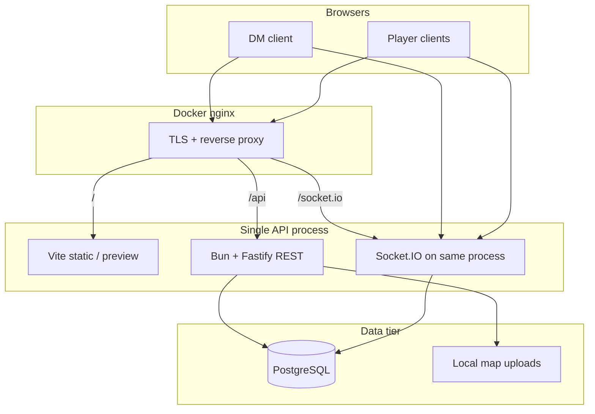

# System architecture (as built)

This document describes **how DCC Web works today**. For decision rationale, see [docs/adr/README.md](./adr/README.md). For the remediation roadmap, see [plan.md](../plan.md) at the repo root.

## Goals

1. **Session-centric play** — A DM runs one or more concurrent *games*; each game has players, characters, monsters, and a tactical map.
2. **Role-based visibility** — DM sees all characters in a game; players see only their own.
3. **Rich character sheets** — Stats, equipment, consumables, server-side dice.
4. **Tactical map** — DM uploads maps, places tokens, draws overlays; movement radius from DCC rules.
5. **Live sync** — Socket.IO pushes game events to room `game:{gameId}`.

## High-level diagram

**Not in production today:** Redis adapter, S3 map storage, horizontal API scaling — see ADR-003 and ADR-005.

## Monorepo

| Package | Stack | Role |
|---------|-------|------|
| `apps/web` | React 19, MUI, Konva, Vite | SPA: lobby, game page, sheets, map |
| `apps/api` | Bun, Fastify, Prisma, Socket.IO | REST + WebSocket + map file serving |
| `packages/shared` | TypeScript, Zod | DTOs, validators, DCC domain logic |

### `apps/web`

| Area | Implementation |
|------|----------------|
| Auth | Email login/register; session via httpOnly cookie |
| Game page | `useGamePageController` + domain hooks under `hooks/game/` |
| Server state | REST on mount + reconnect; mutations return `{ patch }`; **no TanStack Query** (ADR-004) |
| Live updates | `game:patch` WebSocket events → `applyGamePatch` reducer (ADR-006); legacy invalidation pings retired |
| Map | `react-konva` tactical canvas |

### `apps/api`

| Module | Responsibility |
|--------|----------------|
| `auth` | Register, login, verify-email, dev-login (dev only) |
| `games` | CRUD, settings, invite join, audit log |
| `characters` | CRUD, status, inventory |
| `monsters` | Spawn, patch, catalog, transfer-item |
| `maps` | Upload, tokens, drawings |
| `initiative` | Start/advance/end with optimistic locking |
| `realtime` | `publish()` → Socket.IO room `game:{id}` |

**Plugins:** `authenticate`, `requireMember`, `requireDm`, rate limits, membership LRU cache.

### `packages/shared`

Grouped by domain under `src/` (combat, dice, inventory, map, initiative, monsters, characters, schemas). Public API is the root `index.ts` barrel — apps import `@dcc-web/shared` only.

## Core flows

### DM creates a game

1. `POST /games` → game row + default map + invite code.
2. Client navigates to `/games/:id`, loads detail/characters/maps via REST.
3. Socket `game:join` → room membership + presence broadcast.

### Live updates

1. Client sends a command via REST (PATCH/POST/DELETE).
2. API persists in Postgres, builds a **`GamePatch`** (`packages/shared/src/game-patch.ts`), returns it on the HTTP response, and publishes the same patch on Socket.IO as `game:patch`.
3. **Initiator** applies the response patch locally (skips the socket event when `actorUserId` matches).
4. **Other clients** apply the socket patch via `applyGamePatch` — no full list refetch.
5. **Reconnect** runs `resyncAll()` (full `loadDetail`, characters, monsters, maps, dice rolls) as the only sanctioned catch-up after missed events.

Animation-only events (`damage:applied`, `dice:rolled`) remain; they do not drive list reloads.

See [ADR-006](./adr/006-realtime-state-delivery.md).

### Map upload

1. DM multipart POST → magic-byte validation → hash-named file under `STORAGE_PATH/maps/`.
2. URL stored on `GameMap.imageUrl`; served at `/uploads/maps/...`.

## Security model

| Role | How determined | Characters | Map edit | Game admin |
|------|----------------|------------|----------|------------|
| DM | `games.dm_user_id === userId` | All | Yes | Yes |
| Player | `game_players` row | Own only | No* | No |
| co-DM | **Not implemented** | — | — | — |

\*Players may move their own PC token when game settings allow.

- All game routes: JWT cookie + `requireMember` or `requireDm`.
- WebSocket: same JWT from cookie on handshake.
- `GamePlayerRole.co_dm` exists in the schema for future use; all joins create `player` role today.

## Technology choices (actual)

| Concern | Choice |
|---------|--------|
| Runtime | Bun |
| ORM | Prisma + PostgreSQL |
| API | Fastify 5, Pino logging, request IDs |
| Realtime | Socket.IO, single process (ADR-003) |
| Map files | Local FS (ADR-005) |
| Client state | React hooks + socket sync (ADR-004) |
| Forms | Controlled inputs + Zod from shared |
| Map canvas | react-konva |

## Production topology

See [DEPLOYMENT.md](./DEPLOYMENT.md): Docker nginx + Postgres; API and Vite preview on host ports; **one API worker**.

## Related docs

- [DATA-MODEL.md](./DATA-MODEL.md)
- [DEPLOYMENT.md](./DEPLOYMENT.md)
- [DEVELOPMENT.md](./DEVELOPMENT.md)
- [ADR index](./adr/README.md)
- [Remediation plan](../plan.md)
