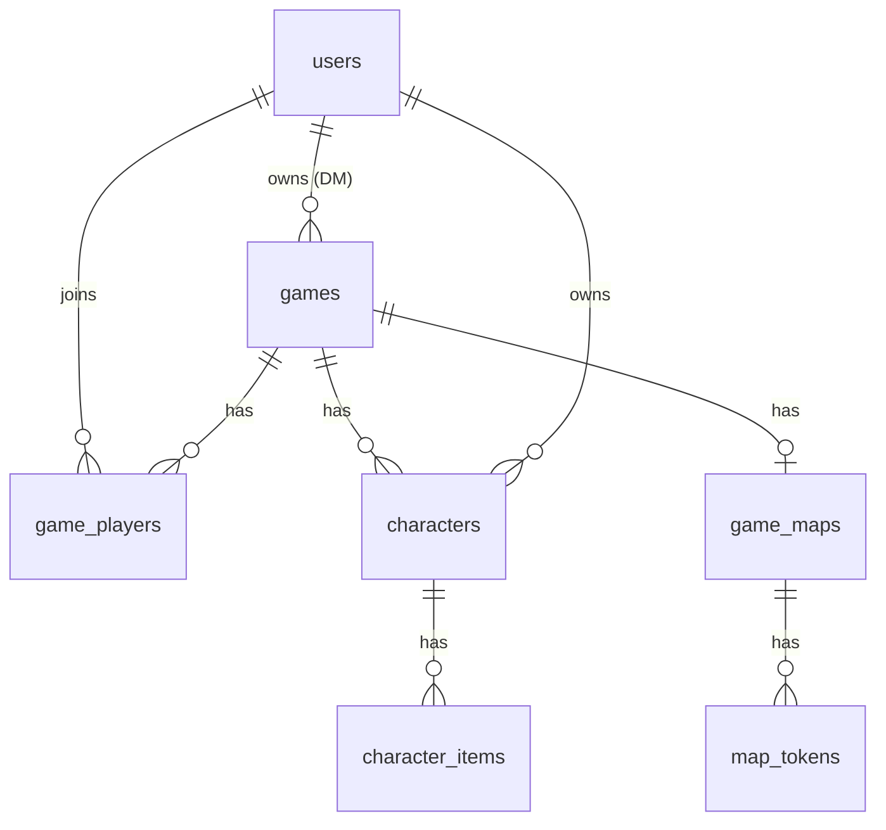

# Data model

PostgreSQL-oriented schema. JSONB columns hold Purple Sorcerer overflow and custom fields without schema churn.

## Entity relationship (conceptual)



## Tables

### `users`

| Column | Type | Notes |
|--------|------|-------|
| id | UUID PK | |
| email | citext unique | |
| display_name | text | |
| password_hash | text | nullable if OAuth |
| created_at | timestamptz | |

### `games`

| Column | Type | Notes |
|--------|------|-------|
| id | UUID PK | |
| dm_user_id | UUID FK → users | Owner |
| title | text | |
| invite_code | text unique | Short code for join URL |
| status | enum | `active`, `archived` |
| active_map_id | UUID FK | nullable |
| monsters_visible_on_map | boolean | |
| shared_monster_initiative | boolean | |
| hide_monster_ac_in_roll_log | boolean | |
| grid_ft_per_cell | decimal | default 5 |
| player_token_movement | enum | `free`, `approval` |
| created_at | timestamptz | |

Game settings are typed columns (Phase 2.1); API composes a `settings` object at read time. Initiative lives in `game_initiative` (separate table).

DM may have **many** active games; client tracks `activeGameId`.

### `game_players`

| Column | Type | Notes |
|--------|------|-------|
| game_id | UUID FK | |
| user_id | UUID FK | |
| role | enum | `player` only at runtime; `co_dm` reserved for future (see ADR / ARCHITECTURE — not implemented) |
| joined_at | timestamptz | |
| PK | (game_id, user_id) | |

### `characters`

One user may have **multiple** characters per game.

| Column | Type | Notes |
|--------|------|-------|
| id | UUID PK | |
| game_id | UUID FK | |
| owner_user_id | UUID FK → users | |
| name | text | |
| level | int | |
| class_name | text | DCC class |
| alignment | text | |
| portrait_url | text nullable | |
| stats | jsonb | See **Stats blob** |
| combat | jsonb | AC, HP, attack bonuses |
| notes | text | |
| source | enum | `manual`, `purple_sorcerer`, `import` |
| source_payload | jsonb nullable | Raw import for re-map |
| status | enum | `alive`, `dead` — dead sheets retained |
| died_at | timestamptz nullable | Set when marked dead |
| version | int | Optimistic concurrency |
| updated_at | timestamptz | |

**Stats blob** (`stats` jsonb):

```json
{
  "abilities": {
    "str": { "score": 14, "modifier": 1 },
    "agi": { "score": 12, "modifier": 0 },
    "sta": { "score": 10, "modifier": 0 },
    "per": { "score": 11, "modifier": 0 },
    "int": { "score": 8, "modifier": -1 },
    "lck": { "score": 16, "modifier": 2 }
  },
  "saves": { "ref": 1, "frt": 0, "wil": -1 },
  "skills": [{ "name": "Sneak", "bonus": 2 }],
  "speed": 30,
  "initiative": 2
}
```

### `character_items`

Normalized inventory; category drives UI tabs.

| Column | Type | Notes |
|--------|------|-------|
| id | UUID PK | |
| character_id | UUID FK | |
| category | enum | `weapon`, `armor`, `treasure`, `misc`, `disposable` |
| name | text | |
| quantity | int default 1 | |
| weight | numeric nullable | |
| properties | jsonb | damage, AC bonus, consumable flags |
| sort_order | int | Drag reorder |
| notes | text | |

**Disposable** examples: torches, rations, oil, potions — `properties: { "uses": 3, "unit": "torch" }`.

### `game_maps`

One primary map per game (extend to multiple scenes later).

| Column | Type | Notes |
|--------|------|-------|
| id | UUID PK | |
| game_id | UUID FK unique | 1:1 for v1 |
| image_url | text | |
| width_px | int | |
| height_px | int | |
| grid_cell_px | int | |
| grid_ft_per_cell | numeric | |
| dm_drawings | jsonb | Vector strokes (Konva export) |
| updated_at | timestamptz | |

### `map_tokens`

| Column | Type | Notes |
|--------|------|-------|
| id | UUID PK | |
| map_id | UUID FK | |
| kind | enum | `pc`, `npc`, `object` |
| character_id | UUID FK nullable | Link PC to sheet |
| label | text | |
| x | numeric | Grid or px per `position_mode` |
| y | numeric | |
| color | text | Hex |
| icon_url | text nullable | |
| movement_ft | int nullable | Override for radius tool |
| updated_at | timestamptz | |

## API authorization matrix

| Operation | DM | Player |
|-----------|----|--------|
| List characters in game | all | `owner_user_id = me` |
| Get character by id | yes | own only |
| Update character | yes | own only |
| Delete character | yes | own only |
| Update map / tokens | yes | no (unless setting) |
| View map | yes | yes |

Enforce in a single `assertGameAccess(userId, gameId, minRole)` helper.

## WebSocket event catalog (draft)

| Event | Direction | Payload |
|-------|-----------|---------|
| `game:join` | C→S | `{ gameId }` |
| `character:updated` | S→C | `{ characterId, patch, version }` |
| `map:token_moved` | S→C | `{ tokenId, x, y }` |
| `map:drawings_updated` | S→C | `{ dmDrawings }` |
| `presence:update` | S→C | `{ userId, status }` |

## Indexes

- `characters (game_id, owner_user_id)`
- `games (dm_user_id, status)`
- `game_players (user_id)`
- `games (invite_code)` unique
