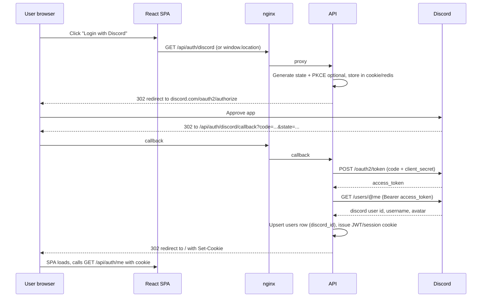

# Discord authentication

Discord is a good fit for tabletop groups that already coordinate in a server. DCC Web uses the standard **OAuth 2.0 authorization code flow** — the browser never sees your Discord **client secret**; only the API exchanges the code server-side.

## Prerequisites

1. [Discord Developer Portal](https://discord.com/developers/applications) → **New Application**
2. **OAuth2** → add redirect URI (must match exactly):
   - Local (via nginx): `http://localhost:8080/api/auth/discord/callback`
   - Prod: `https://your-domain.com/api/auth/discord/callback`
3. Copy **Client ID** and **Client Secret** into API env (`DISCORD_CLIENT_ID`, `DISCORD_CLIENT_SECRET`)
4. Scopes for login: `identify` (username, avatar, id). Optional later: `email` if you need email on file.

## Flow (step by step)



## API routes (skeleton)

| Route | Purpose |
|-------|---------|
| `GET /auth/discord` | Redirect to Discord authorize URL |
| `GET /auth/discord/callback` | Validate `state`, exchange `code`, upsert user, set session |
| `GET /auth/me` | Return current user from JWT/cookie |
| `POST /auth/logout` | Clear session cookie |

## User record mapping

| Discord | `users` table |
|---------|----------------|
| `id` (snowflake string) | `discord_id` unique |
| `username` + optional `global_name` | `display_name` |
| Avatar hash | `avatar_url` = CDN URL |
| (no email unless `email` scope) | `email` nullable |

Link strategy: **one Discord account → one app user**. If you later add email/password, use a `user_identities` table or nullable `password_hash` on the same row.

## Security notes

- **Validate `state`** on callback (CSRF) — store in httpOnly short-lived cookie or server session.
- **Never** put `DISCORD_CLIENT_SECRET` in the React bundle.
- Use **httpOnly, Secure, SameSite=Lax** cookies for session JWT in production.
- Redirect URI whitelist in Discord portal only — no open redirects after login (`returnTo` must be same-origin path allowlist).

## Local development with Docker

nginx proxies `/api` → `api:3001`, so redirect URI should use the **public URL the user hits** (port 80 on localhost), not the internal Docker service name.

## Optional: Discord server roles

Not required for MVP. Advanced: bot + `guilds.members.read` to auto-assign “DM” if user has a role in your guild — adds bot setup and GDPR/consent complexity; defer until core app works.

## Environment variables

```env
DISCORD_CLIENT_ID=
DISCORD_CLIENT_SECRET=
DISCORD_REDIRECT_URI=http://localhost/api/auth/discord/callback
JWT_SECRET=
SESSION_COOKIE_NAME=dcc_session
```

See `apps/api/src/routes/auth.ts` for skeleton handlers (callback stub until secrets are configured).
